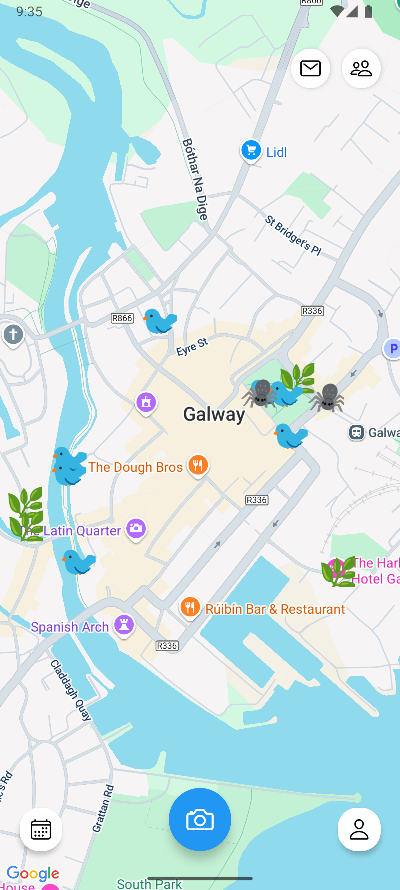
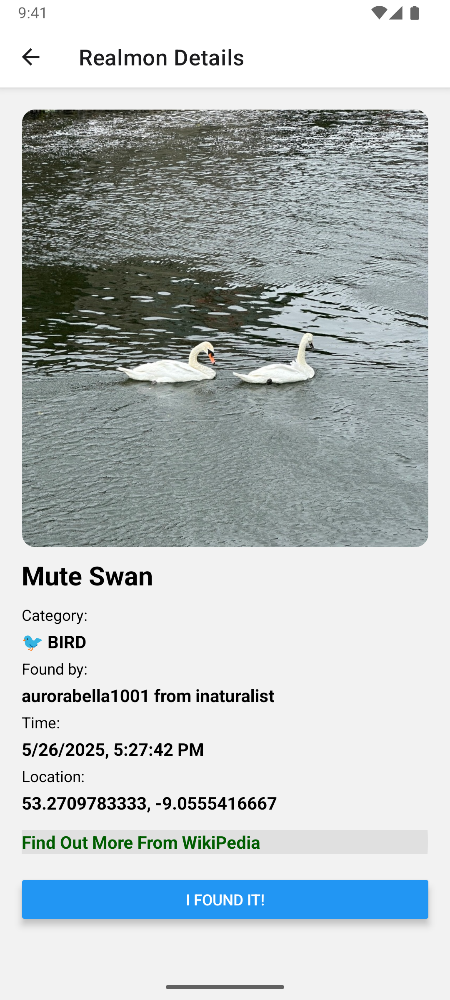

# RealMon GO 🦋 (Frontend)

A mobile app that connects people with nearby species through a playful and reflective experience, built using **React Native**.

> RealMon = Real-time + Pokémon-like nature moments 🐛  
> Reconnect with the real world, one creature at a time 🌿

## 📸 Screenshots

RealMon Go is just getting started — it's still a bit rough, but it's going to be really fun!

<p float="left">
  
  
</p>

---

## 🌟 Features

- 📍 Location-based nature exploration
- 📸 Take and upload photos of real-world species
- 🧠 Get instant AI species recognition (powered by backend)
- 🗺️ Interactive map with nearby RealMon
- 🏆 Gamified user progress and reflection prompts

---

## 🧱 Tech Stack

- **React Native** (Expo)
- **TypeScript**
- **React Navigation**
- **React Native Maps** – interactive maps
- **Firebase FCM** – optional push notifications
- **Backend**: Spring Boot + MySQL (via REST APIs)
- **DevOps**：AWS + Docker

---

## Local development

Install dependencies and create local environment settings:

```bash
npm ci
cp .env.example .env
```

Start the Spring Boot backend on port `8080`, then run one of:

```bash
npm run web
npm run ios
npm run android
```

`EXPO_PUBLIC_API_BASE_URL` controls which backend the app uses:

- Expo Web and the iOS Simulator can normally use `http://localhost:8080`.
- An Android emulator normally uses `http://10.0.2.2:8080`.
- A physical phone must use the development computer's LAN address, such as `http://192.168.1.100:8080`.

Do not commit `.env`; only `.env.example` is tracked.
